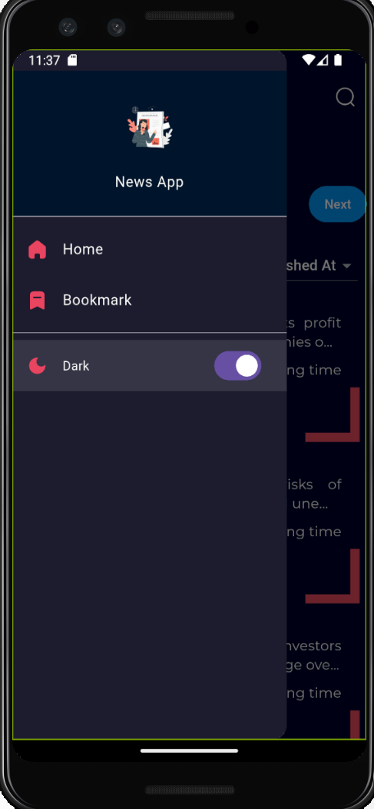
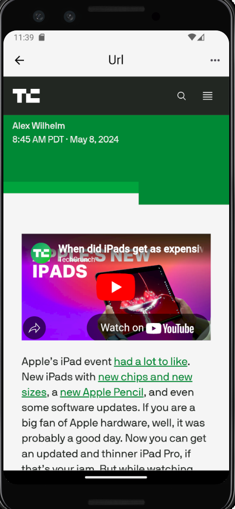

## 📰 Mini News App

A lightweight Flutter app that displays trending and recent news articles using data from the NewsAPI. Built with Provider for state management and flutter_swiper_plus for a smooth UI experience.

## 🚀 Features 
🗞️ Fetches Top Trending News from NewsAPI
🧾 Displays Recent News Articles
🔄 Pull-to-Refresh (optional enhancement)
🧩 Provider-based state management
🎨 Clean Material Design with custom loading widgets

## Screenshots
<table style="border: none; border-collapse: collapse;">
  <tr>
    <td align="center" style="padding: 30px;"> Home Page</td>
    <td align="center" style="padding: 30px;"> Top Trending</td>
  </tr>
  <tr>
    <td align="center" style="padding: 30px;"> Side Bar</td>
    <td align="center" style="padding: 30px;"> News</td>
  </tr>
</table>

## 📦 Dependencies
    According to pubspec.yaml

## 🧱 Folder Structure
    lib/
    │
    ├── main.dart
    ├── screens/
    │   └── home_screen.dart
    ├── widgets/
    │   ├── top_trending.dart
    │   ├── article_widget.dart
    │   ├── toptrending_loading.dart
    │   └── loading_widget.dart
    ├── providers/
    │   └── news_provider.dart
    ├── services/
    │   └── api_handler.dart

## 🔧 Setup & Run
1. Clone the repo
 git clone https://github.com/Christopher-Thi-Ha-Naing/news-app.git
 cd news-app

2. Install Packages
 flutter pub get

3. Set up your NewsAPI key
 Go to https://newsapi.org
 Sign up and get your free API key.
 Add it to your API handler file (API_handler.dart)

4. Run the app
 flutter run

## 🛡️ License
This project is for educational and demonstration purposes only. Make sure to comply with NewsAPI's Terms of Use.

👨‍💻 Developer
    Chris
📧 christopher.thihanaing1996@gmail.com
🔗 https://github.com/Christopher-Thi-Ha-Naing
